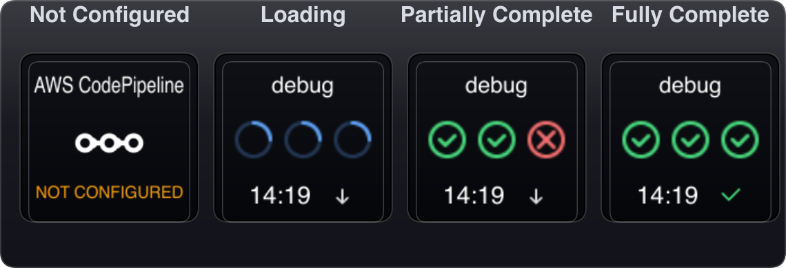

# AWS Monitor for Stream Deck
[](https://docs.elgato.com/streamdeck/sdk/)
[](https://nodejs.org/)
[](https://docs.elgato.com/streamdeck/sdk/introduction/distribution)

A Stream Deck plugin for monitoring AWS services, starting with **CodePipeline**.

It renders stage-by-stage status directly on the key and supports fast actions for refresh, AWS Console open, and optional CloudWatch log access.

## Screenshots

Order: `Not Configured` -> `Loading` -> `Partially Complete` -> `Fully Complete`



## Why This Plugin

- See deployment status without switching tabs.
- Read stage-level result at a glance (`Succeeded` / `Failed` / `InProgress`).
- Keep a live operational signal on your Stream Deck.

## Features

- Real-time CodePipeline stage monitoring
- Visual key rendering with status icons and timestamp footer
- Status transition animation (`0.3s` loading transition on state change)
- Long press (`1.3s`) to open pipeline in AWS Console
- Double-click to open CloudWatch Log Group (optional)
- Debug simulation mode (`Pipeline Name = debug`)
- Configurable polling timeout (`Polling Max (minutes)`)
- Independent `Pipeline Region` and `Log Group Region`

## Requirements

- Stream Deck software `6.5+`
- Node.js `20`
- macOS `12+` or Windows `10+`
- AWS credentials with CodePipeline read access

## Quick Start

```bash
git clone https://github.com/PhantasWeng/streamdeck-aws-monitor
cd streamdeck-aws-monitor
npm install
npm build:bundle
npx streamdeck install com.phantas-weng.aws-monitor.sdPlugin
```

## Usage

1. Open Stream Deck and drag **CodePipeline** action to a key.
2. Fill settings in Property Inspector and save.
3. Use key interactions:

- Short press: Refresh Status
- Double-click: Open CloudWatch Log Group (when configured)
- Long press (`1.3s`): Open CodePipeline in AWS Console

## Configuration

| Field | Required | Description |
| --- | --- | --- |
| `AWS_ACCESS_KEY_ID` | Yes (except debug) | AWS access key |
| `AWS_SECRET_ACCESS_KEY` | Yes (except debug) | AWS secret key |
| `Pipeline Name` | Yes | CodePipeline name; set `debug` to enable simulation mode |
| `Pipeline Region` | Yes (except debug) | Region for CodePipeline API calls |
| `Display Name` | No | Custom key title |
| `Log Group Name` | No | CloudWatch log group for double-click action |
| `Log Group Region` | No | Region for CloudWatch log URL; defaults to pipeline region |
| `Polling Max (minutes)` | No | Polling timeout; default `30` |

## Debug Mode

Set `Pipeline Name` to `debug`.

Behavior:
- Starts with three loading stages
- Simulates partial and full completion states
- Uses the same rendering and transition logic as normal mode
- Stops polling when all succeeded or timeout is reached

## IAM Permissions

Minimum policy example:

```json
{
  "Version": "2012-10-17",
  "Statement": [
    {
      "Effect": "Allow",
      "Action": ["codepipeline:GetPipelineState"],
      "Resource": "arn:aws:codepipeline:*:*:*"
    }
  ]
}
```

## Development

Run watch mode:

```bash
yarn watch
```

Run Stream Deck in debug mode (macOS):

```bash
open -a "Elgato Stream Deck" --args -debug
```

Project structure:

```text
aws-monitor/
├── src/
│   ├── actions/codepipeline.ts
│   └── plugin.ts
├── com.phantas-weng.aws-monitor.sdPlugin/
│   ├── manifest.json
│   ├── ui/codepipeline.html
│   └── imgs/
├── scripts/
├── package.json
└── rollup.config.mjs
```

## Release Workflow

Use:

```bash
yarn build
```

What it does:
- Runs `build:bundle`
- Shows current plugin version from `manifest.json`
- Prompts for next version
- Packs plugin into `releases/`
- Creates git tag `v<version>`

Notes:
- Build stops if tag already exists.
- Tag push is manual:

```bash
git push origin <tag>
```

## Screenshot Asset Generation

Regenerate README screenshot assets:

```bash
yarn screenshots:key-states
```

This regenerates `docs/images/key-states/*.png`, including `overview.png`.

## Troubleshooting

- Key stays in `NOT CONFIGURED`:
  verify required fields are saved.
- Double-click does nothing:
  check `Log Group Name` and `Log Group Region`.
- No updates after completion:
  polling intentionally stops when all stages are `Succeeded`; short-press to refresh.

## Contributing

Issues and pull requests are welcome.

Recommended flow:

1. Fork the repo
2. Create a feature branch
3. Make changes and validate behavior on Stream Deck
4. Open a pull request with context and screenshots

## License

MIT
