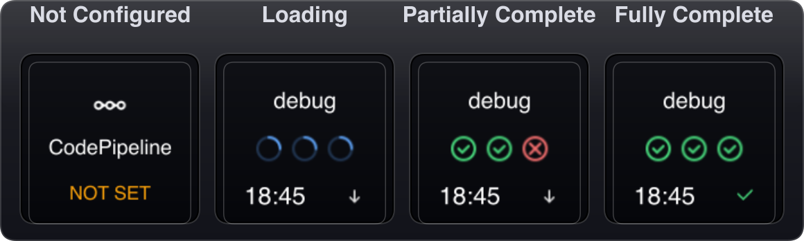
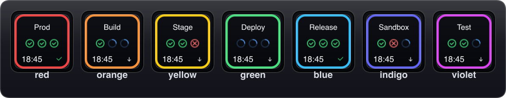

# AWS Monitor for Stream Deck
[](https://docs.elgato.com/streamdeck/sdk/)
[](https://nodejs.org/)
[](https://docs.elgato.com/streamdeck/sdk/introduction/distribution)

A Stream Deck plugin for monitoring AWS services, starting with **CodePipeline**.

It renders stage-by-stage deployment status directly on the key, colors each key by environment, and offers fast actions for refresh, AWS Console, and optional CloudWatch logs.

## Screenshots



_Key states: `Not Configured` → `Loading` → `Partially Complete` → `Fully Complete`._

## Why This Plugin

- See deployment status without switching tabs.
- Read stage-level result at a glance (`Succeeded` / `Failed` / `InProgress`).
- Keep a live operational signal on your Stream Deck.

## Features

- Real-time CodePipeline stage monitoring
- Visual key rendering with status icons and a timestamp footer
- Optional colored border per key for environment identification (`red` / `orange` / `yellow` / `green` / `blue` / `indigo` / `violet`)
- Two-speed, never-stopping polling: fast (`60s`) while a stage is running, idle (`5m`) once settled — automatically picks up the next deployment
- Status transition animation (`0.3s` loading overlay on state change)
- Short press to refresh; long press (`1.3s`) to open the pipeline in AWS Console
- Double-click to open the CloudWatch Log Group (optional)
- Debug simulation mode (`Pipeline Name = debug`) — no AWS credentials needed
- Independent `Pipeline Region` and `Log Group Region`

### Environment Border Colors

Pick a **Border Color** in the Property Inspector to frame the key — handy for telling `stage` / `release` / `production` apart at a glance. Leave it empty for no border.



## Requirements

- Stream Deck software `6.9+`
- macOS `12+` or Windows `10+`
- AWS credentials with CodePipeline read access
- Node.js `20` (only to build from source)

## Installation

### From a release (recommended)

Download the latest `.streamDeckPlugin` from the [Releases page](https://github.com/PhantasWeng/streamdeck-aws-monitor/releases/latest) and double-click it to install.

### From source

```bash
git clone https://github.com/PhantasWeng/streamdeck-aws-monitor
cd streamdeck-aws-monitor
yarn install
yarn build:bundle
npx streamdeck install com.phantas-weng.aws-monitor.sdPlugin
```

## Usage

1. Open Stream Deck and drag the **CodePipeline** action onto a key.
2. Fill in the settings in the Property Inspector and save.
3. Interact with the key:

| Interaction | Action |
| --- | --- |
| Short press | Refresh status |
| Double-click | Open CloudWatch Log Group (when configured) |
| Long press (`1.3s`) | Open the pipeline in AWS Console |

## Configuration

| Field | Required | Description |
| --- | --- | --- |
| `AWS_ACCESS_KEY_ID` | Yes (except debug) | AWS access key |
| `AWS_SECRET_ACCESS_KEY` | Yes (except debug) | AWS secret key |
| `Pipeline Name` | Yes | CodePipeline name; set to `debug` to enable simulation mode |
| `Pipeline Region` | Yes (except debug) | Region for CodePipeline API calls |
| `Display Name` | No | Custom key title |
| `Border Color` | No | Environment border color (`red`/`orange`/`yellow`/`green`/`blue`/`indigo`/`violet`); empty for none |
| `Log Group Name` | No | CloudWatch log group for the double-click action |
| `Log Group Region` | No | Region for the CloudWatch log URL; defaults to the pipeline region |
| `Polling Max (minutes)` | No | How long a single running deployment is fast-watched before dropping to idle polling; default `30` |

## Debug Mode

Set `Pipeline Name` to `debug` to preview the plugin without AWS credentials.

- Starts with three loading stages, then simulates partial and full completion
- Uses the same rendering, transition, and two-speed polling logic as normal mode

## IAM Permissions

Minimum policy:

```json
{
  "Version": "2012-10-17",
  "Statement": [
    {
      "Effect": "Allow",
      "Action": ["codepipeline:GetPipelineState"],
      "Resource": "arn:aws:codepipeline:*:*:*"
    }
  ]
}
```

## Development

```bash
yarn watch       # rebuild + restart the plugin on change
yarn test        # run the vitest suite
yarn lint        # Biome lint check
```

Launch Stream Deck in debug mode to view plugin logs (macOS):

```bash
open -a "Elgato Stream Deck" --args -debug
```

Project structure:

```text
aws-monitor/
├── src/
│   ├── actions/codepipeline.ts   # action class + polling orchestration
│   ├── rendering.ts              # node-canvas key rendering
│   ├── polling.ts                # pure poll-cadence logic
│   ├── settings.ts               # settings types + pure helpers
│   └── plugin.ts                 # entry point
├── com.phantas-weng.aws-monitor.sdPlugin/
│   ├── manifest.json
│   ├── ui/codepipeline.html      # Property Inspector
│   └── imgs/
├── scripts/                      # build / bump / screenshot tooling
├── package.json
└── rollup.config.mjs
```

## Release Workflow

Versioning is owned by `yarn bump`; packaging is a separate step.

```bash
yarn bump <major|minor|patch|build|x.y.z.w>   # add --dry-run to preview
```

`yarn bump`:
- Computes the next 4-part version (`major.minor.patch.build`) and writes it into `manifest.json`
- Generates a `CHANGELOG.md` section from commits since the last tag (grouped by Conventional-Commit prefix)
- Commits and creates an annotated tag `v<version>` (does **not** push)

Push the tag to publish a GitHub Release (packing runs in CI via `.github/workflows/release.yml`):

```bash
git push && git push origin v<version>
```

For a local `.streamDeckPlugin` build (packaging only, no versioning/tag):

```bash
yarn build
```

## Screenshot Asset Generation

```bash
yarn screenshots:key-states
```

Regenerates `docs/images/key-states/*.png`, including `overview.png` and `border-colors.png`.

## Troubleshooting

- **Key stays in `NOT SET`:** verify the required fields are saved.
- **Double-click does nothing:** check `Log Group Name` and `Log Group Region`.
- **Slow updates after completion:** once all stages settle, polling drops to a slower cadence (every `5` minutes) but keeps running to auto-detect the next deployment; short-press to refresh immediately.

## Contributing

Issues and pull requests are welcome.

1. Fork the repo
2. Create a feature branch
3. Make changes and validate behavior on Stream Deck (`yarn test` + `yarn lint`)
4. Open a pull request with context and screenshots

## License

MIT
