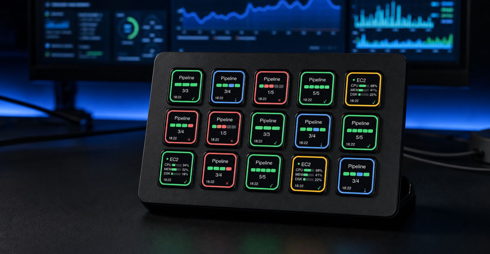

# AWS Monitor for Stream Deck
[](https://docs.elgato.com/streamdeck/sdk/)
[](https://nodejs.org/)
[](https://docs.elgato.com/streamdeck/sdk/introduction/distribution)

A Stream Deck plugin for monitoring AWS services, with two actions:

- **CodePipeline** — stage-by-stage deployment status on the key.
- **EC2** — instance state plus live CPU / memory / disk usage on the key.

Both render status directly on the key, color each key by environment, and offer fast actions for refresh, AWS Console, and CloudWatch.

## Screenshots



*AWS Monitor running on a Stream Deck MK.2 with CodePipeline and EC2 status keys in an AWS monitoring workspace.*


_CodePipeline key states: `Not Configured` → `Loading` → `Partially Complete` → `Fully Complete`._

## Why This Plugin

- See deployment and instance status without switching tabs.
- Read the result at a glance (pipeline stages, or EC2 state + resource usage).
- Keep a live operational signal on your Stream Deck.

## Features

### Shared

- Optional colored border per key for environment identification (`red` / `orange` / `yellow` / `green` / `blue` / `indigo` / `violet`), with configurable border width (default `6px`)
- Two-speed, never-stopping polling: fast (`60s`) while active, idle (`5m`) once settled — automatically picks up the next change
- Status transition animation (`0.3s` loading overlay on state change)
- Debug simulation mode — no AWS credentials needed
- Credentials entered in the Property Inspector; `~/.aws/credentials` and `AWS_*` environment variables are never read

### CodePipeline action

- Real-time CodePipeline stage monitoring
- Segmented progress bar colored per stage (works with any number of stages), a `done/total` counter, and a timestamp footer
- Fast polling while a stage is running; idle polling once all stages settle (all succeeded or a failure)
- Independent `Pipeline Region` and `Log Group Region`
- Short press to refresh; double-click to open the CloudWatch Log Group (optional); long press (`0.8s`) to open the pipeline in AWS Console

### EC2 action

- Real-time EC2 instance state (`running` / `stopped` / `pending` / `stopping` / `terminated` …), color-coded, with a large state label when the instance isn't running
- While running, renders **CPU** plus optional **memory** and **disk** usage rows — memory and disk require the [CloudWatch Agent](https://docs.aws.amazon.com/AmazonCloudWatch/latest/monitoring/Install-CloudWatch-Agent.html) on the instance; without it, only CPU is shown
- CloudWatch metrics are fetched only while the instance is running (saves API calls otherwise)
- Single `Region` shared by both the EC2 and CloudWatch calls
- Short press to refresh; double-click to open CloudWatch metrics; long press (`0.8s`) to open the instance in the EC2 Console

### Environment Border Colors

Pick a **Border Color** in the Property Inspector to frame the key — handy for telling `stage` / `release` / `production` apart at a glance. Leave it empty for no border. Adjust **Border Width (px)** to taste (default `6`).


## Requirements

- Stream Deck software `6.9+`
- macOS `12+` or Windows `10+`
- An AWS access key pair (`AWS_ACCESS_KEY_ID` / `AWS_SECRET_ACCESS_KEY`) with permission for the API each action calls — see [IAM Permissions](#iam-permissions)
- CodePipeline: the pipeline name and its region — EC2: the instance ID and its region

Optional, per feature:

- **CodePipeline double-click → CloudWatch logs**: a `Log Group Name` (and its region, if different from the pipeline region)
- **EC2 memory / disk metrics**: the CloudWatch Agent installed on the instance
- **Long press → AWS Console**: no extra setting, but your browser must be signed in to the AWS Console

You do **not** need:

- **aws-cli** — the plugin talks to AWS via the AWS SDK directly; credentials are entered in the Property Inspector, and `~/.aws/credentials` / `AWS_*` environment variables are never read
- **Node.js** — Stream Deck `6.9+` ships its own Node.js `20` runtime (installing Node is only needed to build from source)

## Installation

### From a release (recommended)

Download the latest `.streamDeckPlugin` from the [Releases page](https://github.com/PhantasWeng/streamdeck-aws-monitor/releases/latest) and double-click it to install.

### From source

```bash
git clone https://github.com/PhantasWeng/streamdeck-aws-monitor
cd streamdeck-aws-monitor
yarn install
yarn build:bundle
npx streamdeck install com.phantas-weng.aws-monitor.sdPlugin
```

## Usage

1. Open Stream Deck and drag the **CodePipeline** or **EC2** action onto a key.
2. Fill in the settings in the Property Inspector and save.
3. Interact with the key:

**CodePipeline**

| Interaction | Action |
| --- | --- |
| Short press | Refresh status |
| Double-click | Open CloudWatch Log Group (when configured) |
| Long press (`0.8s`) | Open the pipeline in AWS Console |

**EC2**

| Interaction | Action |
| --- | --- |
| Short press | Refresh status |
| Double-click | Open CloudWatch metrics for the instance |
| Long press (`0.8s`) | Open the instance in the EC2 Console |

## Configuration

### CodePipeline

| Field | Required | Description |
| --- | --- | --- |
| `Access Key ID` | Yes (except debug) | AWS access key |
| `Secret Access Key` | Yes (except debug) | AWS secret key |
| `Pipeline Name` | Yes | CodePipeline name; set to `debug` to enable simulation mode |
| `Pipeline Region` | Yes (except debug) | Region for CodePipeline API calls |
| `Display Name` | No | Custom key title |
| `Border Color` | No | Environment border color (`red`/`orange`/`yellow`/`green`/`blue`/`indigo`/`violet`); empty for none |
| `Border Width (px)` | No | Border line width in px; default `6` |
| `Log Group Name` | No | CloudWatch log group for the double-click action |
| `Log Group Region` | No | Region for the CloudWatch log URL; defaults to the pipeline region |
| `Polling Max (minutes)` | No | How long a single running deployment is fast-watched before dropping to idle polling; default `30` |

### EC2

| Field | Required | Description |
| --- | --- | --- |
| `Access Key ID` | Yes (except debug) | AWS access key |
| `Secret Access Key` | Yes (except debug) | AWS secret key |
| `Instance ID` | Yes | EC2 instance ID (e.g. `i-0123456789abcdef0`); set to `debug` to enable simulation mode |
| `Region` | Yes (except debug) | Region shared by the EC2 and CloudWatch API calls |
| `Display Name` | No | Custom key title |
| `Border Color` | No | Environment border color (`red`/`orange`/`yellow`/`green`/`blue`/`indigo`/`violet`); empty for none |
| `Border Width (px)` | No | Border line width in px; default `6` |

## Debug Mode

Preview a key without AWS credentials by setting its identifier field to `debug`:

- **CodePipeline** — set `Pipeline Name` to `debug`. Simulates one deployment run at a time: all stages start loading, then succeed one by one; a stage may randomly fail, which ends the run — the next round starts automatically. Use `debug:N` (e.g. `debug:6`) to simulate `N` stages (`1`–`12`).
- **EC2** — set `Instance ID` to `debug`. Cycles through `pending` → `running` → `stopping` → `stopped`, showing simulated CPU / memory / disk metrics while running.

Both reuse the same rendering, transition, and two-speed polling logic as normal mode.

## IAM Permissions

Use a dedicated IAM user scoped to only what each action calls.

**CodePipeline** — `codepipeline:GetPipelineState`, scoped to the pipelines you monitor:

```json
{
  "Version": "2012-10-17",
  "Statement": [
    {
      "Effect": "Allow",
      "Action": ["codepipeline:GetPipelineState"],
      "Resource": "arn:aws:codepipeline:<region>:<account-id>:<pipeline-name>"
    }
  ]
}
```

**EC2** — `ec2:DescribeInstances`, `ec2:DescribeInstanceStatus`, and `cloudwatch:GetMetricData`. These APIs do not support resource-level ARNs, so `Resource` must be `*`:

```json
{
  "Version": "2012-10-17",
  "Statement": [
    {
      "Effect": "Allow",
      "Action": [
        "ec2:DescribeInstances",
        "ec2:DescribeInstanceStatus",
        "cloudwatch:GetMetricData"
      ],
      "Resource": "*"
    }
  ]
}
```

> [!IMPORTANT]
> Credentials are stored as plaintext in the Stream Deck settings file, so use a dedicated IAM user with a least-privilege key like the ones above — never a personal or admin key. SSO / assume-role / session tokens are not supported; only long-term access keys work.

## Development

```bash
yarn watch       # rebuild + restart the plugin on change
yarn test        # run the vitest suite
yarn lint        # Biome lint check
```

Launch Stream Deck in debug mode to view plugin logs (macOS):

```bash
open -a "Elgato Stream Deck" --args -debug
```

Project structure:

```text
aws-monitor/
├── src/
│   ├── actions/
│   │   ├── codepipeline.ts       # CodePipeline action + polling orchestration
│   │   └── ec2.ts                # EC2 action + polling orchestration
│   ├── rendering.ts              # CodePipeline key rendering (node-canvas)
│   ├── ec2-rendering.ts          # EC2 key rendering (node-canvas)
│   ├── polling.ts                # pure poll-cadence logic
│   ├── settings.ts               # settings types + pure helpers
│   ├── ec2-settings.ts           # EC2 settings types + pure helpers
│   └── plugin.ts                 # entry point (registers both actions)
├── com.phantas-weng.aws-monitor.sdPlugin/
│   ├── manifest.json
│   ├── ui/
│   │   ├── codepipeline.html      # CodePipeline Property Inspector
│   │   └── ec2.html               # EC2 Property Inspector
│   └── imgs/
├── scripts/                      # build / bump / screenshot tooling
├── package.json
└── rollup.config.mjs
```

## Release Workflow

Versioning is owned by `yarn bump`; packaging is a separate step.

```bash
yarn bump <major|minor|patch|build|x.y.z.w>   # add --dry-run to preview
```

`yarn bump`:
- Computes the next 4-part version (`major.minor.patch.build`) and writes it into `manifest.json`
- Generates a `CHANGELOG.md` section from commits since the last tag (grouped by Conventional-Commit prefix)
- Commits and creates an annotated tag `v<version>` (does **not** push)

Push the tag to publish a GitHub Release (packing runs in CI via `.github/workflows/release.yml`):

```bash
git push && git push origin v<version>
```

For a local `.streamDeckPlugin` build (packaging only, no versioning/tag):

```bash
yarn build
```

## Screenshot Asset Generation

```bash
yarn screenshots:key-states
```

Regenerates `docs/images/key-states/*.png`, including `overview.png` and `border-colors.png`.

## Troubleshooting

- **Key stays in `NOT SET`:** verify the required fields are saved.
- **EC2 shows no memory / disk:** those metrics require the CloudWatch Agent on the instance; CPU works without it.
- **CodePipeline double-click does nothing:** check `Log Group Name` and `Log Group Region`.
- **Slow updates after completion:** once a pipeline settles (or an instance stops changing), polling drops to a slower cadence (every `5` minutes) but keeps running to auto-detect the next change; short-press to refresh immediately.

## Contributing

Issues and pull requests are welcome.

1. Fork the repo
2. Create a feature branch
3. Make changes and validate behavior on Stream Deck (`yarn test` + `yarn lint`)
4. Open a pull request with context and screenshots

## License

MIT
